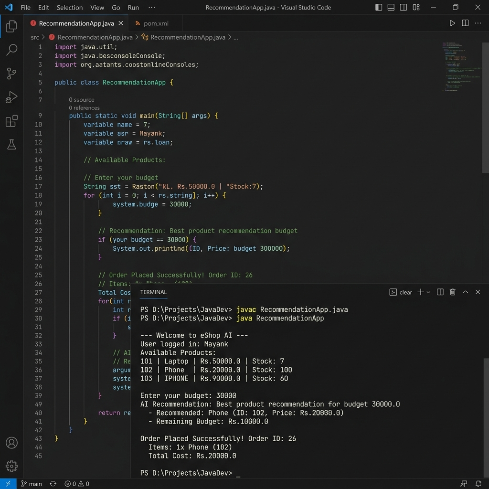

# Java E-Commerce Console Application

A Java + MySQL console-based e-commerce project that now includes AI-based product recommendations and a Java 24 run/debug setup.

## Features

- User login and auto-registration fallback
- Product listing and stock management
- Cart handling with edge-case quantity attempts
- Order placement with transaction safety
- Out-of-stock adjustment and safe retry flow
- Order details and order history display
- Order cancellation
- AI recommendation prompt based on budget + purchase history

## Tech Stack

- Java 24 (console app)
- JDBC
- MySQL
- VS Code Java tooling
- MySQL JDBC driver (`lib/mysql-connector-j-9.5.0.jar`)

## Project Structure

```text
JavaProject/
|- .vscode/
|  |- settings.json
|  |- launch.json
|- src/
|  |- Main.java
|  |- App.java
|  |- model/
|  |  |- User.java
|  |  |- Product.java
|  |  |- Cart.java
|  |  |- CartItem.java
|  |  |- Order.java
|  |  |- OrderItem.java
|  |  |- OrderResponse.java
|  |  |- OrderStatus.java
|  |  |- StockIssue.java
|  |- service/
|  |  |- UserService.java
|  |  |- ProductService.java
|  |  |- CartService.java
|  |  |- OrderService.java
|  |  |- AIService.java
|  |- util/
|     |- DBConnection.java
|     |- EnvLoader.java
|- lib/
|  |- mysql-connector-j-9.5.0.jar
|- bin/
|- .env
|- README.md
```

## Core Flow (Main)

1. Login user, register if not found
2. Display available products
3. Ask for user budget and call AI recommendation flow
4. Add products to cart (including deliberate over-stock test)
5. Place order and handle status-based responses
6. If out of stock, adjust quantities and retry once
7. Show order details and order history
8. Ask for order id to cancel
9. Print updated stock

Recent update: input `Scanner` is shared across the flow and closed once in `main`, removing the resource-leak warning.

## Database Setup (MySQL)

Run the following SQL first:

```sql
CREATE DATABASE IF NOT EXISTS ecommerce;
USE ecommerce;

CREATE TABLE IF NOT EXISTS users (
	id INT PRIMARY KEY AUTO_INCREMENT,
	name VARCHAR(100) NOT NULL,
	email VARCHAR(150) NOT NULL UNIQUE,
	password VARCHAR(255) NOT NULL
);

CREATE TABLE IF NOT EXISTS products (
	id INT PRIMARY KEY,
	name VARCHAR(150) NOT NULL,
	price DOUBLE NOT NULL,
	stock INT NOT NULL,
	description TEXT
);

CREATE TABLE IF NOT EXISTS orders (
	id INT PRIMARY KEY AUTO_INCREMENT,
	user_id INT NOT NULL,
	total DOUBLE NOT NULL,
	status VARCHAR(30) NOT NULL,
	FOREIGN KEY (user_id) REFERENCES users(id)
);

CREATE TABLE IF NOT EXISTS order_items (
	id INT PRIMARY KEY AUTO_INCREMENT,
	order_id INT NOT NULL,
	product_id INT NOT NULL,
	quantity INT NOT NULL,
	price DOUBLE NOT NULL,
	FOREIGN KEY (order_id) REFERENCES orders(id),
	FOREIGN KEY (product_id) REFERENCES products(id)
);
```

Seed sample products:

```sql
INSERT INTO products (id, name, price, stock, description) VALUES
(101, 'Laptop', 50000, 10, 'Performance laptop'),
(102, 'Phone', 20000, 20, 'Smartphone'),
(103, 'IPHONE', 90000, 64, 'Premium smartphone')
ON DUPLICATE KEY UPDATE
name = VALUES(name),
price = VALUES(price),
stock = VALUES(stock),
description = VALUES(description);
```

## Configuration

### 1) Database Credentials

Update values in `src/util/DBConnection.java`:

```java
private static final String URL = "jdbc:mysql://localhost:3306/ecommerce";
private static final String USER = "root";
private static final String PASSWORD = "1234";
```

### 2) AI Environment Variables

Create/update `.env` in project root (or set OS env vars):

```env
GEMINI_API_KEY=your_api_key_here
GEMINI_MODEL=gemini-flash-latest
GEMINI_API_URL=https://generativelanguage.googleapis.com/v1beta/models
GEMINI_CONNECT_TIMEOUT_MS=15000
GEMINI_READ_TIMEOUT_MS=90000
GEMINI_MAX_RETRIES=2
```

Notes:
- API key fallback lookup supports `GEMINI_API_KEY`, `GOOGLE_API_KEY`, `NVIDIA_API_KEY`, and `NVAPI_KEY`.
- If no key is set, app continues and prints an AI error message string.

Gemini requests are sent as `generateContent` calls with `X-goog-api-key` and a `contents -> parts -> text` payload.

## Java Version Requirement

Use Java 24 for both compile and run. Mixing Java 24-compiled classes with Java 21 runtime causes:

`UnsupportedClassVersionError ... class file version 68.0 ... recognizes up to 65.0`

This workspace already includes Java 24-focused setup in `.vscode/settings.json` and `.vscode/launch.json`.

## How to Run

### Option 1: Code Runner Extension (Top-Right ▶️ Button)
1. Ensure the **Code Runner** VS Code extension is installed.
2. Open `src/Main.java`.
3. Click the **Play / Run Code** button ▶️ in the top-right corner.
4. Code Runner will open in your VS Code **Terminal** tab (where input prompts can be entered interactively) and execute with the `lib/` classpath attached automatically.

### Option 2: VS Code Java Debugger (Native Run)
1. Open project in VS Code.
2. Open `src/Main.java`.
3. Click **`Run`** above `public static void main(String[] args)` (or press `F5` / `Ctrl + F5`).

### Option 3: PowerShell / Terminal Command
From the project root directory:

```powershell
# Compile all source files into bin with MySQL driver classpath
& 'C:\Program Files\Java\jdk-24\bin\javac.exe' -d bin -cp "lib\mysql-connector-j-9.5.0.jar" src\util\*.java src\model\*.java src\service\*.java src\Main.java

# Run Main class
& 'C:\Program Files\Java\jdk-24\bin\java.exe' -cp "bin;lib\mysql-connector-j-9.5.0.jar" Main
```

---

## Code Execution Preview



## Recent Changes & Setup Fixes

- **JDBC Driver Registration**: Added explicit `Class.forName("com.mysql.cj.jdbc.Driver")` static initializer block in `DBConnection.java` to prevent runtime `No suitable driver found` errors.
- **Code Runner Configuration**: Configured `.vscode/settings.json` with `code-runner.executorMap` and `code-runner.runInTerminal: true` so Code Runner executes in interactive terminal mode with `lib/*` classpath attached.
- **VS Code Classpath Cleanup**: Fixed `.vscode/settings.json` by removing `lib` from `sourcePaths` and ensuring `referencedLibraries` targets `lib/*.jar`.
- **Git Ignore Updates**: Added `*.txt` pattern to `.gitignore` to prevent committing scratch notes and interview preparation text files.

## Sample Output Highlights

- User logged in / registered
- Available products shown
- Budget prompt and AI recommendation printed
- Cart shown with stock handling
- Order placed (or adjusted retry on out-of-stock)
- Order history printed
- Cancel order prompt
- Updated stock printed

## Future Improvements

- Add bcrypt password hashing
- Add menu-driven CLI instead of fixed scripted flow
- Improve numeric input validation for all prompts
- Add tests and CI workflow
- Migrate to Maven/Gradle for dependency management
- Add REST API layer with Spring Boot

## Author

Maintained by Amit Kumar.

